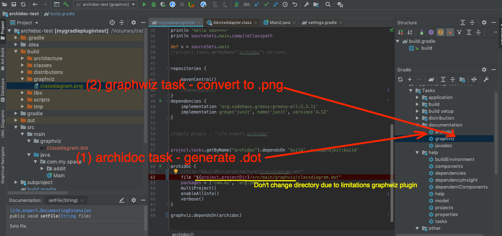
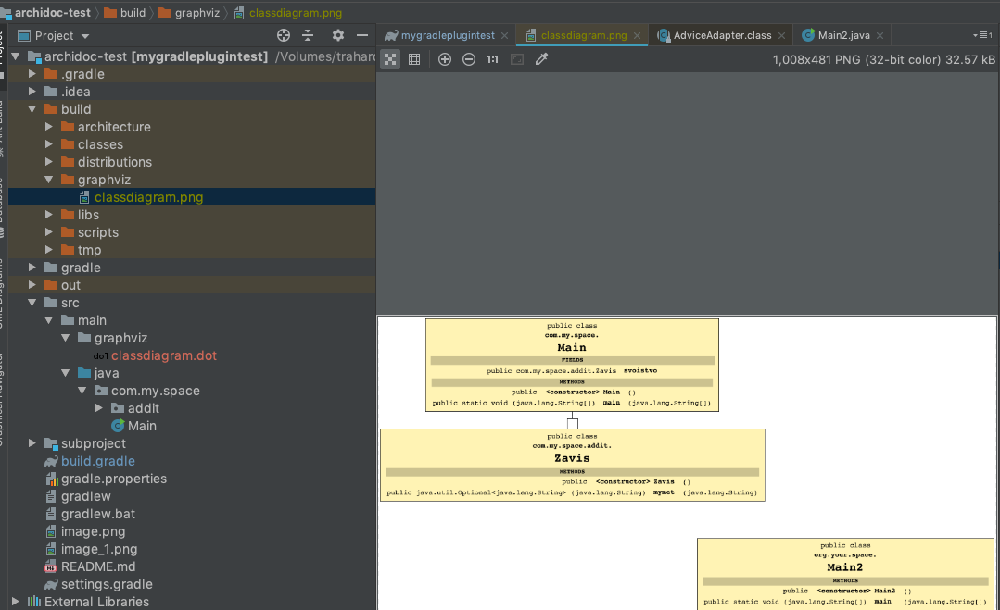

= ArchiDoc Gradle Plugin

== Documenting Software Architecture Plugin
Visualizing code of your application.
It generates full diagram of your classes in .dot(graphviz) file.

Plugin is based on work -  https://github.com/classgraph/classgraph[Classgraph]
You can open the generated dot file in a vector editor.
You can convert then the model into The Standard for exchange of architecture models from The Open Group

Plugin uses all jars in runtimeClasspath configuration
and also main source set build folder (there for the task depends on 'build' task)
Scans both project and subprojects

Plugin avialable at https://plugins.gradle.org/u/wilmerkrisp[gradle plugin portal]

Project for testing athttps://github.com/wilmerkrisp/archidoc-test[gitlab]

== For using plugin in gradle

=== configure plugin in build.gradle, select whrere to put file and your programm packages for analysis.

[source,groovy]
plugins {
    id 'life.expert.archidoc' version '1.0.10'
    }

project.tasks.getByName("archidoc").dependsOn 'build'

archidoc {
file  "$buildDir/architecture/classdiagram.dot"
packages = ['com.my']
enableAllInfo()
}

=== run task archidoc

[source,bash]
 ./gradlew arhidoc

=== Also plugin options avialable:

[source,groovy]
multiProject()          //if you want analyze also gradle subprojects, please build all subprojects because the task doesnot depend on subprojects build-tasks

Also Classgraph options avialable:

[source,groovy]
    verbose()           // print all log messages
    enableAllInfo()    //  all information about classes
    enableFieldInfo()
    enableMethodInfo()
    ignoreFieldVisibility()
    ignoreMethodVisibility()
    enableClassInfo()
    enableAnnotationInfo()
    ignoreClassVisibility()
    enableInterClassDependencies()
    enableExternalClasses()

=== Configuration for multiproject build:

[source,groovy]
project.tasks.getByName("archidoc").dependsOn 'build',**':subproject:build'**
archidoc {
    file "$buildDir/architecture/classdiagram.dot"
    packages = ['com.my', 'org.your']
    **multiProject()**
    enableAllInfo()
    verbose()
}

=== how to instantly get .PNG file

[source,groovy]
----
plugins {
    id "life.expert.archidoc" version "1.0.10"
    id "com.simonharrer.graphviz" version "0.0.1" // thanks to https://github.com/simonharrer/gradle-graphviz-plugin
}

archidoc {
    //Sorry. For "graphviz plugin" No configuration possible.
    //It just converts your **src/main/graphviz/**.dot to build/graphviz/.png.
    file "${project.projectDir}/src/main/graphviz/classdiagram.dot"
    packages = ['org' ]
    enableAllInfo()
}

graphviz.dependsOn(archidoc)
----

== what about 'really' architecture
Programming is an art.
What does a framework look like?
Below is a hierarchical class diagram for the google Truth framework (about 600 items!).
Obtained by using the archidoc plug-in. OmniGraffle was used to convert dot->png.

image:ntruth600_hierarh_plus.png[link="ntruth600_hierarh_plus.png"]

== For inter class dependencies

 Includes class references in local variables or intermediate values

[source,groovy]
 archidoc {
     file  "$buildDir/architecture/classdiagram.dot"
     packages = ['com.my']
     enableAllInfo()
       enableInterClassDependencies()
         enableExternalClasses()
 }

 Here is the simpliest example

 Here is example with enableExternalClasses

== Architecture with JArchitect
image:https://www.jarchitect.com/assets/img/transparentlogo.png["JArchitecture",width=170,link="http://www.jarchitect.com"]
Architecture diagrams is also presented for comparison (coming soon!), built with JArchitect. Thanks to Codegears / CppDepend for the JArchitect.

== Architecture with Structure101
image:http://structure101.com/images/s101_170.png["Structure101",width=170,link="http://www.Structure101.com"]
Architecture diagrams is also presented for comparison (coming soon!), built with Structure101 Studio. Thanks to Structure101 for the Studio/Workspace.

